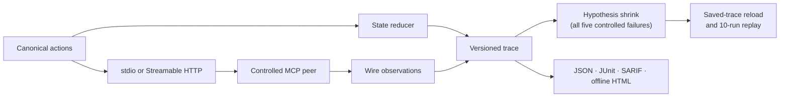

# mcp-statecheck

Stateful differential testing for Model Context Protocol implementations.

[](https://github.com/lxingy3/mcp-statecheck/actions/workflows/ci.yml)
[](https://pypi.org/project/mcp-statecheck/)
[](https://github.com/lxingy3/mcp-statecheck/blob/v0.1.0/LICENSE)

Many MCP failures only appear across a sequence: initialize, overlap requests,
cancel one, reconnect an SSE stream, or recover from an expired session.
`mcp-statecheck` models these interactions as canonical actions and records the
wire behavior as deterministic, redacted traces.

> [!NOTE]
> Version 0.1.0 provides an installable quick-check CLI, deterministic replay
> of package-controlled failures, offline reports, a package-owned SDK matrix,
> a composite Action, and cross-platform acceptance. Arbitrary-target replay
> and the `deep` profile remain intentionally outside this release.

## Quickstart

From a fresh checkout with [uv](https://docs.astral.sh/uv/) installed:

```console
git clone https://github.com/lxingy3/mcp-statecheck.git
cd mcp-statecheck
uv sync --locked
uv run mcp-statecheck check --output artifacts/quickstart.json --junit artifacts/quickstart.xml --sarif artifacts/quickstart.sarif --html artifacts/quickstart.html --stdio -- uv run python -m mcp_statecheck._controlled_peer --stdio --mode sdk-smoke
Check passed: wrote artifacts/quickstart.json
```

The released CLI can also be installed without a checkout:

```console
uv tool install mcp-statecheck==0.1.0
mcp-statecheck --version
mcp-statecheck 0.1.0
```

The same quick profile can target only a server you explicitly name:

```console
mcp-statecheck check --stdio -- python server.py
mcp-statecheck check --url http://127.0.0.1:3000/mcp
mcp-statecheck check --header-env Authorization=MCP_TOKEN --url https://example.test/mcp
```

`--header-env HEADER=ENVIRONMENT_VARIABLE` reads the complete header value
from the environment. The value is never placed in CLI arguments and is
redacted before traces or reports are stored. The bounded quick profile
initializes one session, sends `ping`, probes `tools/list` without calling any
tool, verifies response shapes, and confirms transport cleanup.

## What works today

| Area | Current implementation |
| --- | --- |
| Protocol state | Lifecycle, capability negotiation, pending requests, cancellation, streams, and logical sessions |
| Request identity | Internal action IDs remain separate from MCP request IDs, including duplicate concurrent IDs |
| stdio | JSON Lines subprocess transport with deadlines, bounded stderr, and child cleanup |
| Streamable HTTP | Session headers, JSON and SSE responses, reconnect cursors, status handling, and cleanup |
| Traces | Versioned JSON, deterministic writes, recursive secret redaction, and stable session aliases |
| Installed CLI | Explicit-target checks, allowlisted replay, offline reports, and the locked 16-cell SDK matrix with `0`/`1`/`2` exit codes |
| Reports | Deterministic JSON, JUnit XML, SARIF 2.1.0, and a script-free single-file HTML trace explorer |
| Automation | A JSON-argv composite Action plus scheduled macOS runs of the full SDK matrix and clean-package acceptance |
| Controlled peers | Five controlled scenarios exercised over real stdio or localhost HTTP connections |
| M2 controlled corpus | Five seeded RuleBasedStateMachine failures with stable signatures, shrinking, saved-trace reload, and 10-run replay |
| M3 real SDK clients | Four isolated Python and TypeScript SDK runners across two released protocol revisions and both transports, with 16/16 cells checked against saved traces |



The checked-in [M1 acceptance report](https://github.com/lxingy3/mcp-statecheck/blob/v0.1.0/artifacts/m1/acceptance.json) records the
pinned Python runtime, exact passing test count, and all five M1 fixture checks
within a 180-second hard deadline. CI runs the locked project on Ubuntu and
Windows.

## Reproduce the M1 baseline

Install [uv](https://docs.astral.sh/uv/), then run:

```console
uv sync --locked
uv run python scripts/run_m1_acceptance.py
uv build
```

The acceptance command runs the full test suite and writes one wire trace per
controlled fixture to `artifacts/m1/`.

## Controlled defect corpus

| Fixture | Transport | Observation preserved by M1 |
| --- | --- | --- |
| `http-error-as-timeout` | Streamable HTTP | An HTTP 503 remains distinct from a timeout |
| `duplicate-concurrent-request-id` | stdio | Two pending calls retain separate logical identities despite sharing one MCP request ID |
| `second-sse-resume-token-loss` | Streamable HTTP | Each reconnect sends the newest event ID |
| `request-before-initialized` | stdio | A request issued before initialization completes remains visible in the trace |
| `late-response-after-cancellation` | stdio | A cancelled result is cross-correlated with the later call |

For example, the HTTP error fixture records the protocol result and cleanup
state separately:

```json
{
  "fixture_id": "http-error-as-timeout",
  "transport": "streamable-http",
  "normalized_events": [
    {
      "kind": "http_error",
      "status": 503
    }
  ],
  "cleanup": {
    "client_closed": true,
    "listener_closed": true
  }
}
```

M1 preserves the observations required for detection. M2 now closes that loop
for all five controlled defects:

```console
$ uv run python scripts/run_m2_slice.py --fixture http-error-as-timeout
M2 slice passed: minimized and replayed 10 times; wrote artifacts/m2/http-error-as-timeout.json
$ uv run python scripts/run_m2_slice.py
M2 slice passed: minimized and replayed 10 times; wrote artifacts/m2/request-before-initialized.json
$ uv run python scripts/run_m2_slice.py --fixture duplicate-concurrent-request-id
M2 slice passed: minimized and replayed 10 times; wrote artifacts/m2/duplicate-concurrent-request-id.json
$ uv run python scripts/run_m2_slice.py --fixture late-response-after-cancellation
M2 slice passed: minimized and replayed 10 times; wrote artifacts/m2/late-response-after-cancellation.json
$ uv run python scripts/run_m2_slice.py --fixture second-sse-resume-token-loss
M2 slice passed: minimized and replayed 10 times; wrote artifacts/m2/second-sse-resume-token-loss.json
```

Hypothesis reduces the generated sequence to `initialize` followed by
`tools/list` for the lifecycle case, and to two overlapping `tools/call`
requests sharing one ID for the request-identity case. The cancellation case
uses fixture canaries to detect a full response cross-swap after `call-a` is
cancelled and `call-b` is pending. That oracle is enabled only for this
controlled fixture, and it verifies the cancellation request ID and both sides
of the swap without assuming a response order. A late response alone is not
classified as a failure. Each saved trace is loaded from disk and replayed
against ten fresh peers; every run produces the expected stable signature.

The HTTP slice proves that a real 503 reached the transport before a controlled
client adapter misclassifies it as a timeout. The SSE slice keeps the expected
latest cursor in the canonical action while the controlled adapter omits it on
the second reconnect, after the required initialized notification; the peer
captures the actual cursor, session, and protocol headers. Each HTTP candidate
and replay uses a fresh localhost peer, verifies client and listener cleanup,
and verifies session deletion when a session was established.

The installed replay command accepts only checked-in artifacts with the
versioned `controlled-fixture` target recipe:

```console
$ mcp-statecheck replay artifacts/m2/request-before-initialized.json
Replay reproduced mcp-statecheck:v1:62237ccbaf578ac57aedd89b1b34c81c01913f6541dc3d3d414fbc180fd25dc2 in 10/10 attempts
```

Reproducing the protocol or differential failure exits `1`. Invalid artifacts,
unknown recipe versions or fixture IDs, startup failures, and cleanup failures
exit `2`. The recipe schema has exactly three fields: `version`, `kind`, and
`fixture_id`. It cannot store or execute a command, URL, environment variable,
or working directory.

## Reproduce M3

The client matrix covers four pinned SDK runners, both released protocol
revisions in the benchmark, and both stdio and Streamable HTTP. It requires
`uv` and Node.js 24.14.1; the command installs the exact isolated Python and
npm dependencies:

| Runner | SDK | 2025-06-18 | 2025-11-25 |
| --- | --- | --- | --- |
| `python-v1` | `mcp 1.28.1` | [stdio](https://github.com/lxingy3/mcp-statecheck/blob/v0.1.0/artifacts/m3/stdio/python-v1-2025-06-18.json) / [HTTP](https://github.com/lxingy3/mcp-statecheck/blob/v0.1.0/artifacts/m3/streamable-http/python-v1-2025-06-18.json) | [stdio](https://github.com/lxingy3/mcp-statecheck/blob/v0.1.0/artifacts/m3/stdio/python-v1-2025-11-25.json) / [HTTP](https://github.com/lxingy3/mcp-statecheck/blob/v0.1.0/artifacts/m3/streamable-http/python-v1-2025-11-25.json) |
| `python-v2` | `mcp 2.0.0` | [stdio](https://github.com/lxingy3/mcp-statecheck/blob/v0.1.0/artifacts/m3/stdio/python-v2-2025-06-18.json) / [HTTP](https://github.com/lxingy3/mcp-statecheck/blob/v0.1.0/artifacts/m3/streamable-http/python-v2-2025-06-18.json) | [stdio](https://github.com/lxingy3/mcp-statecheck/blob/v0.1.0/artifacts/m3/stdio/python-v2-2025-11-25.json) / [HTTP](https://github.com/lxingy3/mcp-statecheck/blob/v0.1.0/artifacts/m3/streamable-http/python-v2-2025-11-25.json) |
| `typescript-v1` | `@modelcontextprotocol/sdk 1.30.0` | [stdio](https://github.com/lxingy3/mcp-statecheck/blob/v0.1.0/artifacts/m3/stdio/typescript-v1-2025-06-18.json) / [HTTP](https://github.com/lxingy3/mcp-statecheck/blob/v0.1.0/artifacts/m3/streamable-http/typescript-v1-2025-06-18.json) | [stdio](https://github.com/lxingy3/mcp-statecheck/blob/v0.1.0/artifacts/m3/stdio/typescript-v1-2025-11-25.json) / [HTTP](https://github.com/lxingy3/mcp-statecheck/blob/v0.1.0/artifacts/m3/streamable-http/typescript-v1-2025-11-25.json) |
| `typescript-v2` | `@modelcontextprotocol/client 2.0.0` | [stdio](https://github.com/lxingy3/mcp-statecheck/blob/v0.1.0/artifacts/m3/stdio/typescript-v2-2025-06-18.json) / [HTTP](https://github.com/lxingy3/mcp-statecheck/blob/v0.1.0/artifacts/m3/streamable-http/typescript-v2-2025-06-18.json) | [stdio](https://github.com/lxingy3/mcp-statecheck/blob/v0.1.0/artifacts/m3/stdio/typescript-v2-2025-11-25.json) / [HTTP](https://github.com/lxingy3/mcp-statecheck/blob/v0.1.0/artifacts/m3/streamable-http/typescript-v2-2025-11-25.json) |

```console
$ uv run python scripts/run_m3_client_matrix.py --check --output artifacts/m3
Matrix passed: 16/16 locked SDK transport cells match artifacts
```

The installed command uses the bundled canonical benchmark by default:

```console
$ mcp-statecheck matrix --output artifacts/matrix
Matrix passed: wrote 16 locked SDK transport traces
```

Each runner performs initialization, ping, tool discovery, and one `echo` tool
call against a controlled peer. For each protocol revision, all four runners
produce the same normalized events. The HTTP traces additionally prove
post-initialize session and protocol header preservation, valid content
negotiation, session deletion, and listener cleanup. The check also forces one
Python and one TypeScript SDK call per transport to hit the outer timeout and
verifies cleanup.

## Reports and CI integration

Saved traces are the single JSON source of truth. Reports validate schema v1,
redact again at the output boundary, and never contact a network:

```console
$ mcp-statecheck report artifacts/m2/request-before-initialized.json --json report.json --junit report.xml --sarif report.sarif --html report.html
Report wrote 4 files: report.json, report.xml, report.sarif, report.html
```

Because that artifact contains a detected failure, the command writes every
requested report and exits `1`. Malformed input, an I/O/configuration problem,
or a saved infrastructure error exits `2`; a passing artifact exits `0`.

The repository-local composite Action accepts a JSON array rather than a shell
command string:

```yaml
- uses: lxingy3/mcp-statecheck@v0.1.0
  env:
    MCP_TOKEN: ${{ secrets.MCP_TOKEN }}
  with:
    arguments: >-
      ["check", "--url", "https://example.test/mcp",
      "--header-env", "Authorization=MCP_TOKEN",
      "--output", "artifacts/statecheck.json",
      "--junit", "artifacts/statecheck.xml"]
```

The clean-package acceptance command builds both distributions, installs them
outside the source tree, and verifies their import origins. It exercises the
wheel's actual console script against real stdio and localhost Streamable HTTP
peers, replays all five controlled failures ten times from an untrusted working
directory, parses all four outputs for each transport, proves HTTP session
deletion and listener/process cleanup, probes the sdist-installed matrix assets,
runs the wheel-installed 16-cell SDK matrix from an empty directory, compares
every trace with the checked-in goldens, verifies package resources remain
byte-identical, and checks that a runtime authorization secret does not reach
artifacts or process output:

```console
uv run python scripts/run_m4_acceptance.py
```

## Project boundaries

The official
[MCP conformance framework](https://github.com/modelcontextprotocol/conformance)
remains the source for fixed specification scenarios. `mcp-statecheck` is
being built for generated stateful sequences, normalized cross-implementation
comparison, shrinking, and deterministic replay. It complements conformance
rather than replacing it.

Schema lockfiles, API compatibility checks, and protocols other than MCP are
outside the v0.1 scope.

The v0.1 model and matrix target MCP `2025-06-18` and `2025-11-25`. The
newly released `2026-07-28` revision removes protocol-level sessions, the
initialize handshake, and SSE resumption, so it requires a separate stateless
action profile rather than a version-string-only matrix cell.

The installed CLI exposes the bounded `check`, `replay`, `report`, and `matrix`
commands.
The matrix copies only its allowlisted adapter and runner inputs into a
temporary workspace before preparing isolated SDK environments; it never
installs into package resources. Replay accepts only the five package-controlled
fixture recipes and starts only the package-owned peer; artifacts cannot select
an arbitrary executable or network target. The `deep` profile is deferred until
generated sequences can target user-selected servers without weakening these
execution boundaries.

## Roadmap

| Milestone | Status | Scope |
| --- | --- | --- |
| M0 | Complete | Reproducible Python 3.12 environment, lockfile, design baseline, and cross-platform CI |
| M1 | Complete | Canonical model, wire transports, trace recorder, and controlled peers |
| M2 | Complete (5/5 fixtures) | Hypothesis state machine, invariants, differential oracle, signatures, shrinking, and replay |
| M3 | Complete | 16/16 real SDK client cells across stdio and Streamable HTTP, with exact differential traces and cleanup probes |
| M4 | Complete | Quick-check CLI, controlled replay, reports, Action, clean-package acceptance, documentation, and the v0.1 gate |

The exact v0.1 benchmark, limitations, and acceptance evidence are recorded in
the [v0.1.0 release notes](https://github.com/lxingy3/mcp-statecheck/blob/v0.1.0/docs/releases/v0.1.0.md).

## Documentation

- [Design baseline](https://github.com/lxingy3/mcp-statecheck/blob/v0.1.0/docs/design.md)
- [MCP landscape snapshot](https://github.com/lxingy3/mcp-statecheck/blob/v0.1.0/docs/research/2026-07-15-landscape.md)
- [M1 acceptance report](https://github.com/lxingy3/mcp-statecheck/blob/v0.1.0/artifacts/m1/acceptance.json)
- [M2 HTTP classification failure](https://github.com/lxingy3/mcp-statecheck/blob/v0.1.0/artifacts/m2/http-error-as-timeout.json)
- [M2 lifecycle failure](https://github.com/lxingy3/mcp-statecheck/blob/v0.1.0/artifacts/m2/request-before-initialized.json)
- [M2 duplicate request ID failure](https://github.com/lxingy3/mcp-statecheck/blob/v0.1.0/artifacts/m2/duplicate-concurrent-request-id.json)
- [M2 cancellation correlation failure](https://github.com/lxingy3/mcp-statecheck/blob/v0.1.0/artifacts/m2/late-response-after-cancellation.json)
- [M2 SSE resume failure](https://github.com/lxingy3/mcp-statecheck/blob/v0.1.0/artifacts/m2/second-sse-resume-token-loss.json)
- [M3 real SDK client traces](https://github.com/lxingy3/mcp-statecheck/tree/v0.1.0/artifacts/m3)
- [M3 benchmark pins](https://github.com/lxingy3/mcp-statecheck/blob/v0.1.0/benchmarks/mcp-v2.toml)
- [M4 clean-package acceptance](https://github.com/lxingy3/mcp-statecheck/blob/v0.1.0/artifacts/m4/acceptance.json)
- [v0.1.0 release notes](https://github.com/lxingy3/mcp-statecheck/blob/v0.1.0/docs/releases/v0.1.0.md)

## License

Apache-2.0.
