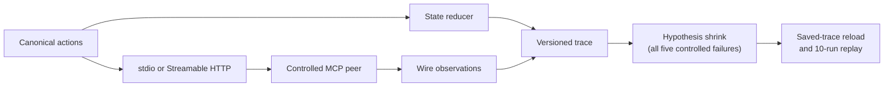

# mcp-statecheck

Stateful differential testing for Model Context Protocol implementations.

[](https://github.com/lxingy3/mcp-statecheck/actions/workflows/ci.yml)
[](LICENSE)

Many MCP failures only appear across a sequence: initialize, overlap requests,
cancel one, reconnect an SSE stream, or recover from an expired session.
`mcp-statecheck` models these interactions as canonical actions and records the
wire behavior as deterministic, redacted traces.

> [!NOTE]
> This project is pre-alpha. M0-M2 are complete across all five controlled
> fixtures. M3 has real results for all eight stdio client cells. Streamable
> HTTP client cells, reports, the CLI, and the v0.1 release gate are still
> ahead.

## What works today

| Area | Current implementation |
| --- | --- |
| Protocol state | Lifecycle, capability negotiation, pending requests, cancellation, streams, and logical sessions |
| Request identity | Internal action IDs remain separate from MCP request IDs, including duplicate concurrent IDs |
| stdio | JSON Lines subprocess transport with deadlines, bounded stderr, and child cleanup |
| Streamable HTTP | Session headers, JSON and SSE responses, reconnect cursors, status handling, and cleanup |
| Traces | Versioned JSON, deterministic writes, recursive secret redaction, and stable session aliases |
| Controlled peers | Five controlled scenarios exercised over real stdio or localhost HTTP connections |
| M2 controlled corpus | Five seeded RuleBasedStateMachine failures with stable signatures, shrinking, saved-trace reload, and 10-run replay |
| M3 stdio clients | Four isolated Python and TypeScript SDK runners across two released protocol revisions, with 8/8 cells checked against saved traces |



The checked-in [M1 acceptance report](artifacts/m1/acceptance.json) records
Python 3.12.13, 150 passing tests, and all five M1 fixture checks within a
180-second hard deadline. CI runs the locked project on Ubuntu and Windows.

## Reproduce the M1 baseline

Install [uv](https://docs.astral.sh/uv/), then run:

```console
uv sync --locked
uv run python scripts/run_m1_acceptance.py
uv build
```

The acceptance command runs the full test suite and writes one wire trace per
controlled fixture to `artifacts/m1/`.

A successful report currently includes:

```json
{
  "fixture_checks_passed": 5,
  "milestone": "M1",
  "python": "3.12.13",
  "status": "passed",
  "tests_passed": 150
}
```

## Controlled defect corpus

| Fixture | Transport | Observation preserved by M1 |
| --- | --- | --- |
| `http-error-as-timeout` | Streamable HTTP | An HTTP 503 remains distinct from a timeout |
| `duplicate-concurrent-request-id` | stdio | Two pending calls retain separate logical identities despite sharing one MCP request ID |
| `second-sse-resume-token-loss` | Streamable HTTP | Each reconnect sends the newest event ID |
| `request-before-initialized` | stdio | A request issued before initialization completes remains visible in the trace |
| `late-response-after-cancellation` | stdio | A cancelled result is cross-correlated with the later call |

For example, the HTTP error fixture records the protocol result and cleanup
state separately:

```json
{
  "fixture_id": "http-error-as-timeout",
  "transport": "streamable-http",
  "normalized_events": [
    {
      "kind": "http_error",
      "status": 503
    }
  ],
  "cleanup": {
    "client_closed": true,
    "listener_closed": true
  }
}
```

M1 preserves the observations required for detection. M2 now closes that loop
for all five controlled defects:

```console
$ uv run python scripts/run_m2_slice.py --fixture http-error-as-timeout
M2 slice passed: minimized and replayed 10 times; wrote artifacts/m2/http-error-as-timeout.json
$ uv run python scripts/run_m2_slice.py
M2 slice passed: minimized and replayed 10 times; wrote artifacts/m2/request-before-initialized.json
$ uv run python scripts/run_m2_slice.py --fixture duplicate-concurrent-request-id
M2 slice passed: minimized and replayed 10 times; wrote artifacts/m2/duplicate-concurrent-request-id.json
$ uv run python scripts/run_m2_slice.py --fixture late-response-after-cancellation
M2 slice passed: minimized and replayed 10 times; wrote artifacts/m2/late-response-after-cancellation.json
$ uv run python scripts/run_m2_slice.py --fixture second-sse-resume-token-loss
M2 slice passed: minimized and replayed 10 times; wrote artifacts/m2/second-sse-resume-token-loss.json
```

Hypothesis reduces the generated sequence to `initialize` followed by
`tools/list` for the lifecycle case, and to two overlapping `tools/call`
requests sharing one ID for the request-identity case. The cancellation case
uses fixture canaries to detect a full response cross-swap after `call-a` is
cancelled and `call-b` is pending. That oracle is enabled only for this
controlled fixture, and it verifies the cancellation request ID and both sides
of the swap without assuming a response order. A late response alone is not
classified as a failure. Each saved trace is loaded from disk and replayed
against ten fresh peers; every run produces the expected stable signature.

The HTTP slice proves that a real 503 reached the transport before a controlled
client adapter misclassifies it as a timeout. The SSE slice keeps the expected
latest cursor in the canonical action while the controlled adapter omits it on
the second reconnect, after the required initialized notification; the peer
captures the actual cursor, session, and protocol headers. Each HTTP candidate
and replay uses a fresh localhost peer, verifies client and listener cleanup,
and verifies session deletion when a session was established.

## Reproduce the current M3 slice

The stdio client matrix covers four pinned SDK runners and both released
protocol revisions in the benchmark. It requires `uv` and Node.js 24.14.1;
the command installs the exact isolated Python and npm dependencies:

| Runner | SDK | 2025-06-18 | 2025-11-25 |
| --- | --- | --- | --- |
| `python-v1` | `mcp 1.28.1` | [trace](artifacts/m3/stdio/python-v1-2025-06-18.json) | [trace](artifacts/m3/stdio/python-v1-2025-11-25.json) |
| `python-v2` | `mcp 2.0.0b2` | [trace](artifacts/m3/stdio/python-v2-2025-06-18.json) | [trace](artifacts/m3/stdio/python-v2-2025-11-25.json) |
| `typescript-v1` | `@modelcontextprotocol/sdk 1.29.0` | [trace](artifacts/m3/stdio/typescript-v1-2025-06-18.json) | [trace](artifacts/m3/stdio/typescript-v1-2025-11-25.json) |
| `typescript-v2` | `@modelcontextprotocol/client 2.0.0-beta.5` | [trace](artifacts/m3/stdio/typescript-v2-2025-06-18.json) | [trace](artifacts/m3/stdio/typescript-v2-2025-11-25.json) |

```console
$ uv run python scripts/run_m3_stdio_matrix.py --check
M3 stdio matrix passed: 8/8 real SDK client cells match artifacts
```

Each runner performs initialization, ping, tool discovery, and one `echo` tool
call against a controlled peer. For each protocol revision, all four runners
produce the same normalized events. The saved traces also record clean SDK
client shutdown and verified reaping of both the adapter and peer processes.
The check additionally forces one Python and one TypeScript SDK call to hit the
outer timeout and verifies that neither process tree remains alive.

This is 8/8 stdio cells and 8/16 cells in the client transport matrix.
Streamable HTTP accounts for the other eight client cells.

## Project boundaries

The official
[MCP conformance framework](https://github.com/modelcontextprotocol/conformance)
remains the source for fixed specification scenarios. `mcp-statecheck` is
being built for generated stateful sequences, normalized cross-implementation
comparison, shrinking, and deterministic replay. It complements conformance
rather than replacing it.

Schema lockfiles, API compatibility checks, and protocols other than MCP are
outside the v0.1 scope.

## Roadmap

| Milestone | Status | Scope |
| --- | --- | --- |
| M0 | Complete | Reproducible Python 3.12 environment, lockfile, design baseline, and cross-platform CI |
| M1 | Complete | Canonical model, wire transports, trace recorder, and controlled peers |
| M2 | Complete (5/5 fixtures) | Hypothesis state machine, invariants, differential oracle, signatures, shrinking, and replay |
| M3 | In progress | stdio client matrix complete at 8/8 cells; eight Streamable HTTP client cells remain |
| M4 | Planned | CLI, JUnit/SARIF/HTML reports, GitHub Action, documentation, and the v0.1 gate |

The source repository is public during development. GitHub Releases and PyPI
publication remain blocked until the full
[v0.1 release gate](docs/design.md#v01-release-gate) passes.

## Documentation

- [Design baseline](docs/design.md)
- [MCP landscape snapshot](docs/research/2026-07-15-landscape.md)
- [M1 acceptance report](artifacts/m1/acceptance.json)
- [M2 HTTP classification failure](artifacts/m2/http-error-as-timeout.json)
- [M2 lifecycle failure](artifacts/m2/request-before-initialized.json)
- [M2 duplicate request ID failure](artifacts/m2/duplicate-concurrent-request-id.json)
- [M2 cancellation correlation failure](artifacts/m2/late-response-after-cancellation.json)
- [M2 SSE resume failure](artifacts/m2/second-sse-resume-token-loss.json)
- [M3 stdio client traces](artifacts/m3/stdio/)
- [M3 benchmark pins](benchmarks/mcp-v2.toml)

## License

Apache-2.0.
