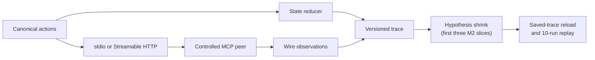

# mcp-statecheck

Stateful differential testing for Model Context Protocol implementations.

[](https://github.com/lxingy3/mcp-statecheck/actions/workflows/ci.yml)
[](LICENSE)

Many MCP failures only appear across a sequence: initialize, overlap requests,
cancel one, reconnect an SSE stream, or recover from an expired session.
`mcp-statecheck` models these interactions as canonical actions and records the
wire behavior as deterministic, redacted traces.

> [!NOTE]
> This project is pre-alpha. M0 and M1 are complete; M2 is in progress. The
> first three seeded failures now generate, shrink, persist, and replay over
> real stdio peers. Broader differential comparison, the remaining two
> fixtures, SDK runners, reports, and the CLI are still ahead.

## What works today

| Area | Current implementation |
| --- | --- |
| Protocol state | Lifecycle, capability negotiation, pending requests, cancellation, streams, and logical sessions |
| Request identity | Internal action IDs remain separate from MCP request IDs, including duplicate concurrent IDs |
| stdio | JSON Lines subprocess transport with deadlines, bounded stderr, and child cleanup |
| Streamable HTTP | Session headers, JSON and SSE responses, reconnect cursors, status handling, and cleanup |
| Traces | Versioned JSON, deterministic writes, recursive secret redaction, and stable session aliases |
| Controlled peers | Five controlled scenarios exercised over real stdio or localhost HTTP connections |
| M2 slices 1-3 | Seeded RuleBasedStateMachine generation, stable failure signatures, shrinking, saved-trace reload, and 10-run replay |



The checked-in [M1 acceptance report](artifacts/m1/acceptance.json) records
Python 3.12.13, 121 passing tests, and all five M1 fixture checks within a
60-second hard deadline. CI runs the locked project on Ubuntu and Windows.

## Reproduce the M1 baseline

Install [uv](https://docs.astral.sh/uv/), then run:

```console
uv sync --locked
uv run python scripts/run_m1_acceptance.py
uv build
```

The acceptance command runs the full test suite and writes one wire trace per
controlled fixture to `artifacts/m1/`.

A successful report currently includes:

```json
{
  "fixture_checks_passed": 5,
  "milestone": "M1",
  "python": "3.12.13",
  "status": "passed",
  "tests_passed": 121
}
```

## Controlled defect corpus

| Fixture | Transport | Observation preserved by M1 |
| --- | --- | --- |
| `http-error-as-timeout` | Streamable HTTP | An HTTP 503 remains distinct from a timeout |
| `duplicate-concurrent-request-id` | stdio | Two pending calls retain separate logical identities despite sharing one MCP request ID |
| `second-sse-resume-token-loss` | Streamable HTTP | Each reconnect sends the newest event ID |
| `request-before-initialized` | stdio | A request issued before initialization completes remains visible in the trace |
| `late-response-after-cancellation` | stdio | A cancelled result is cross-correlated with the later call |

For example, the HTTP error fixture records the protocol result and cleanup
state separately:

```json
{
  "fixture_id": "http-error-as-timeout",
  "transport": "streamable-http",
  "normalized_events": [
    {
      "kind": "http_error",
      "status": 503
    }
  ],
  "cleanup": {
    "client_closed": true,
    "listener_closed": true
  }
}
```

M1 preserves the observations required for later detection. It does not yet
claim the final five-fixture gate. Three M2 slices now close that loop:

```console
$ uv run python scripts/run_m2_slice.py
M2 slice passed: minimized and replayed 10 times; wrote artifacts/m2/request-before-initialized.json
$ uv run python scripts/run_m2_slice.py --fixture duplicate-concurrent-request-id
M2 slice passed: minimized and replayed 10 times; wrote artifacts/m2/duplicate-concurrent-request-id.json
$ uv run python scripts/run_m2_slice.py --fixture late-response-after-cancellation
M2 slice passed: minimized and replayed 10 times; wrote artifacts/m2/late-response-after-cancellation.json
```

Hypothesis reduces the generated sequence to `initialize` followed by
`tools/list` for the lifecycle case, and to two overlapping `tools/call`
requests sharing one ID for the request-identity case. The cancellation case
uses fixture canaries to detect a full response cross-swap after `call-a` is
cancelled and `call-b` is pending. That oracle is enabled only for this
controlled fixture, and it verifies the cancellation request ID and both sides
of the swap without assuming a response order. A late response alone is not
classified as a failure. Each saved trace is loaded from disk and replayed
against ten fresh peer processes; every run produces the expected stable
signature.

## Project boundaries

The official
[MCP conformance framework](https://github.com/modelcontextprotocol/conformance)
remains the source for fixed specification scenarios. `mcp-statecheck` is
being built for generated stateful sequences, normalized cross-implementation
comparison, shrinking, and deterministic replay. It complements conformance
rather than replacing it.

Schema lockfiles, API compatibility checks, and protocols other than MCP are
outside the v0.1 scope.

## Roadmap

| Milestone | Status | Scope |
| --- | --- | --- |
| M0 | Complete | Reproducible Python 3.12 environment, lockfile, design baseline, and cross-platform CI |
| M1 | Complete | Canonical model, wire transports, trace recorder, and controlled peers |
| M2 | In progress (3/5 fixtures) | Hypothesis state machine, invariants, differential oracle, signatures, shrinking, and replay |
| M3 | Planned | Isolated Python and TypeScript v1/v2 SDK runners |
| M4 | Planned | CLI, JUnit/SARIF/HTML reports, GitHub Action, documentation, and the v0.1 gate |

The source repository is public during development. GitHub Releases and PyPI
publication remain blocked until the full
[v0.1 release gate](docs/design.md#v01-release-gate) passes.

## Documentation

- [Design baseline](docs/design.md)
- [MCP landscape snapshot](docs/research/2026-07-15-landscape.md)
- [M1 acceptance report](artifacts/m1/acceptance.json)
- [M2 lifecycle failure](artifacts/m2/request-before-initialized.json)
- [M2 duplicate request ID failure](artifacts/m2/duplicate-concurrent-request-id.json)
- [M2 cancellation correlation failure](artifacts/m2/late-response-after-cancellation.json)

## License

Apache-2.0.
